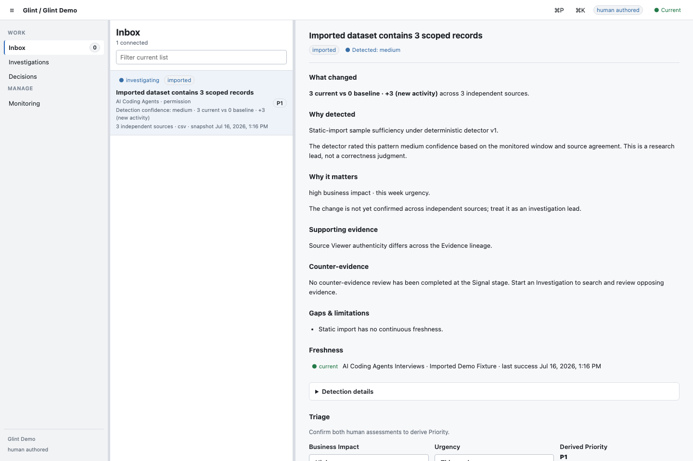
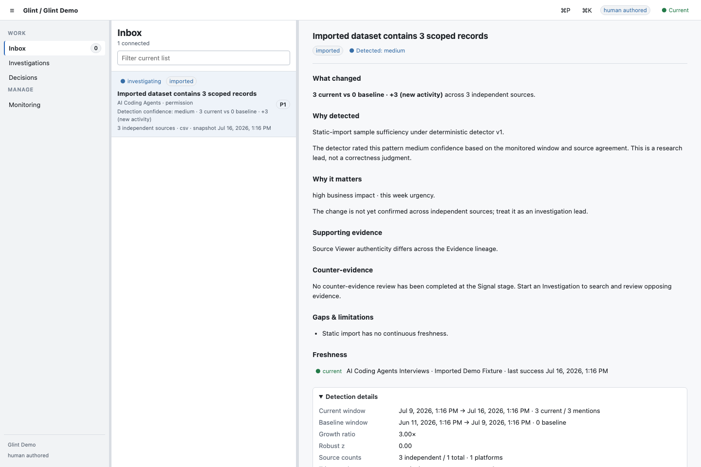
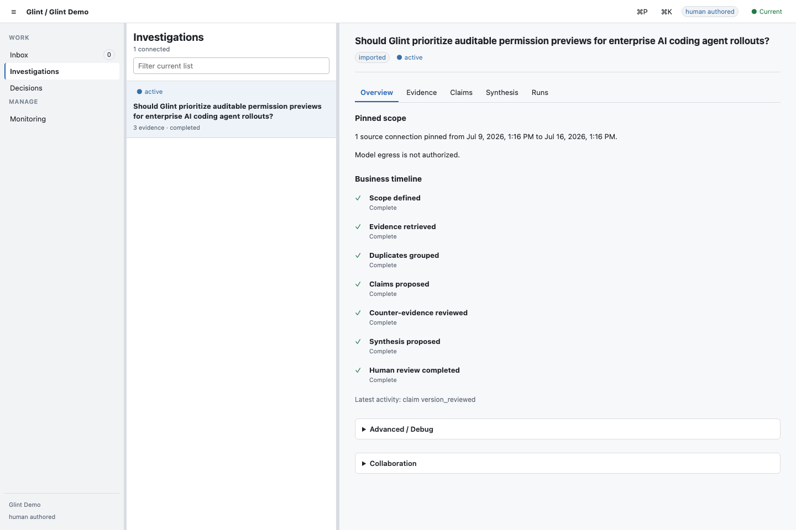
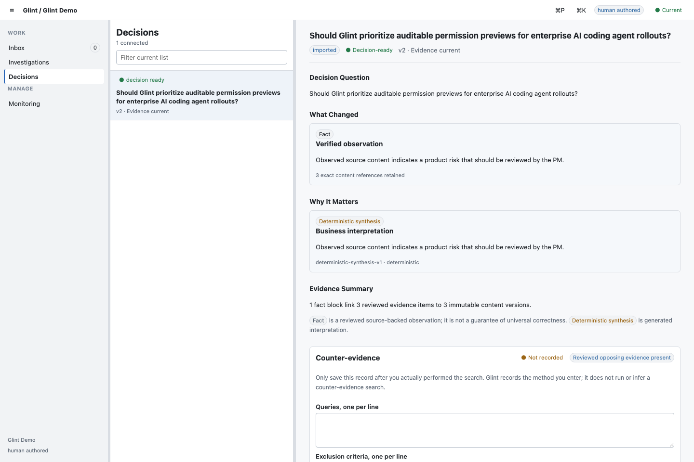
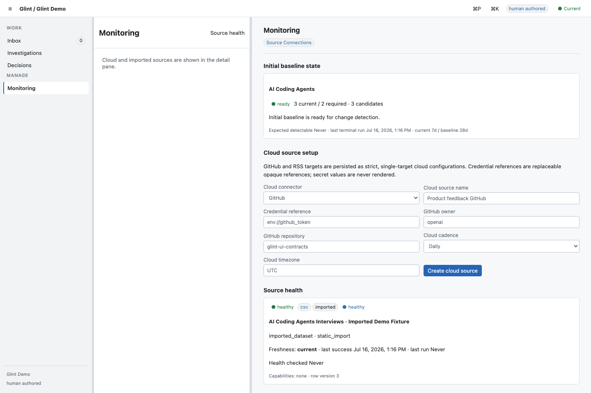
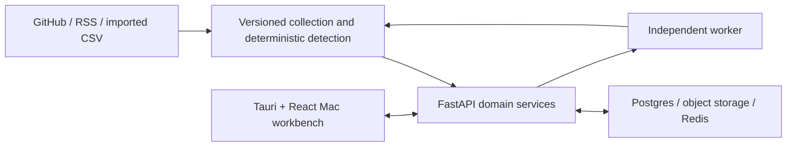

# Glint

Evidence-backed product intelligence for small teams.

**Monitor → Detect → Investigate → Decide**

Glint watches approved product-research sources, turns versioned changes into
explainable Signals, and keeps the evidence, counter-evidence, human reviews,
and final recommendation connected through a Decision Brief.

> The screenshots below are 1440×960 captures of the real React workbench
> backed by the local API, worker, Postgres, and object store. They use the
> clearly labelled **Imported Demo Fixture**; they are not live-network proof.

## What Glint does

- Monitors imported CSV data and the implemented GitHub/RSS connector boundary.
- Explains why a Signal fired with source freshness, trigger rules, counts, and
  limitations instead of presenting an opaque score.
- Guides a reviewer from immutable source evidence through Claims and synthesis
  to a version-bound Decision Brief and PRD Research Input export.

## Product walkthrough

The pilot workflow is implemented in the Mac workbench: Inbox → Signal detail →
Investigation evidence and Claim review → Decision Brief → Markdown export. The
five real-app captures use one reviewed runtime and window size; the
[90-second demo script](./docs/DEMO_SCRIPT.md) documents the matching narrative.











## Core workflow

```text
GitHub / RSS / CSV
→ Signal
→ Investigation
→ Evidence and Claims
→ Decision Brief
→ PRD Research Input
```

## What is real today

| Surface | Evidence today | Authenticity boundary | Model use | Status |
| --- | --- | --- | --- | --- |
| CSV import and review-to-export path | Deterministic local acceptance against the real API, worker, Postgres/RLS, and Mac client | **Imported** test data | **No LLM** | **Passed** |
| GitHub and RSS connectors | Contract, security, pagination, dedupe, and deterministic fixture tests | **Deterministic synthetic fixtures**, not live | **No LLM** | **Passed** |
| Captured public payloads | None committed | **Captured Fixture: not available** | **No LLM** | **Not Applicable** |
| Networked GitHub/RSS smoke | Opt-in read-only runner implemented; no recorded final result | **Live verification** | **No LLM** | **Pending** |
| Mac portfolio screenshots | Real local API/worker/Postgres render at 1440×960 | **Imported Demo Fixture**, visibly labelled | Not applicable | **Passed** |
| Phase 3 Evidence/Claim proposals | Bounded graph, DeepSeek adapter, mocked-provider tests, synthetic replay gate, and a redacted live-adapter smoke | **Generated proposals** over exact pinned ContentVersions | **Opt-in; disabled by default** | **Provisionally Passed** |

“Collected” in the domain model describes connector lineage; it does not by
itself prove that a particular demo or test contacted a live service. Live data
must be accompanied by the separately recorded live-smoke evidence.

Glint P2.5 is a pilot candidate, not a production or GA release. Its accepted
research path remains deterministic. The first Phase 3 slice can generate
model-assisted Evidence and ClaimVersion proposals, but it is disabled by
default and still requires the existing human review gates. Its adapter has a
recorded synthetic live smoke; that is not held-out quality or owner-workflow
acceptance evidence. See the
[model research runtime](./docs/MODEL_RESEARCH.md) and
[provisional quality record](./docs/PHASE3_QUALITY_ACCEPTANCE.md).

Phase 3 acceptance layers use one closed status vocabulary: `Passed`,
`Provisionally Passed`, `Pending`, `Failed`, or `Not Applicable`.

| Verification layer | Status |
| --- | --- |
| Deterministic reviewed replay gate | **Provisionally Passed** |
| Live provider adapter smoke | **Passed** |
| Live held-out quality evaluation | **Pending** |
| Live Mac owner workflow | **Pending** |
| External PM pilot | **Pending** |
| Phase 3 acceptance | **Pending** |

## Run locally

Prerequisites are macOS, Python 3.12, `uv` 0.11.28, Node.js, pnpm 10.28.0, and
Rust. Docker is additionally required for the full deterministic gate.

```bash
git clone https://github.com/shawliu998/Glint.git
cd Glint
cp .env.example .env
uv sync --locked --extra test
pnpm install --frozen-lockfile
```

For the shortest UI walkthrough, start the explicitly synthetic API fixture:

```bash
pnpm --filter @glint/mac exec node e2e/api-fixture.mjs
```

In a second terminal, start the client with the fixture identity:

```bash
VITE_GLINT_DATA_MODE=api \
VITE_GLINT_API_URL=http://127.0.0.1:4174 \
VITE_GLINT_WORKSPACE_ID=00000000-0000-4000-8000-000000000001 \
VITE_GLINT_PRINCIPAL_ID=00000000-0000-4000-8000-000000000002 \
VITE_GLINT_ACCESS_TOKEN=fixture-access-token \
pnpm --filter @glint/mac dev --host 127.0.0.1 --port 5173
```

This walkthrough is a deterministic fixture, not a live connector or production
environment. The full API/worker/Postgres path is created, seeded, exercised,
and torn down by the verification scripts below.

## Build the Mac app

The native gate uses the repository's exact unsigned debug build command:

```bash
pnpm --filter @glint/mac exec tauri build --debug --bundles app --no-sign -- --locked
```

Output: `apps/mac/src-tauri/target/debug/bundle/macos/Glint.app`.

The bundle is **unsigned for distribution and not notarized**. The local build
may carry an ad-hoc/linker signature generated by the toolchain; that is not an
Apple Developer ID signature and is not a distribution claim.

## Verification

Deterministic repository gates:

```bash
./scripts/verify_phase1.sh
./scripts/verify_phase2.sh
./scripts/verify_phase3_quality.sh
./scripts/verify_tauri_runtime.sh
```

The Phase 3 quality command is also an independent CI job. It runs without a
provider credential and uploads four bounded JSON artifacts containing metrics,
failure counts, prompt identifiers and evaluation metadata—not prompts, source
bodies, provider responses or secrets.

The networked smoke is intentionally separate and runs only with explicit user
authorization and configured credentials:

```bash
GLINT_ENABLE_LIVE_SMOKE=1 ./scripts/verify_live_connectors.sh
```

The final implementation candidate (`be6998d`) passed all four required remote
jobs in [GitHub Actions run
29474562575](https://github.com/shawliu998/Glint/actions/runs/29474562575):
Phase 1, Phase 2, security audit, and macOS native. See [P2.5
acceptance](./docs/P2_5_ACCEPTANCE.md) for the remaining live/pilot evidence gaps
and [live-smoke instructions](./docs/LIVE_CONNECTOR_SMOKE.md) for credential and
redaction rules.

## Architecture



The Mac app is a contract client. Domain services own lifecycle transitions and
audits; connectors cannot write Signals, Claims, or decisions directly. Read the
[architecture](./docs/ARCHITECTURE.md), [security model](./docs/SECURITY_MODEL.md),
and [API contracts](./docs/API_CONTRACTS.md) for the technical detail.

## Current limitations

- The `.app` is not Developer ID signed or notarized.
- Live GitHub and RSS smoke has not been recorded for the final P2.5 candidate.
- No external pilot has run; there are no external user results to report.
- A recorded demo video has not been produced.
- Source support is limited to imported CSV plus GitHub/RSS boundaries.
- Production SLOs, operations, disaster recovery, and GA readiness are not
  established.
- Phase 3 model-assisted synthesis after reviewed claims, live held-out quality
  evidence, Langfuse deployment, and full collaboration/RBAC UI remain out of
  scope for the current accepted slice.

The proposed 3–5 person study is documented in the [pilot
plan](./docs/PILOT_PLAN.md). No participant outcomes are claimed.
