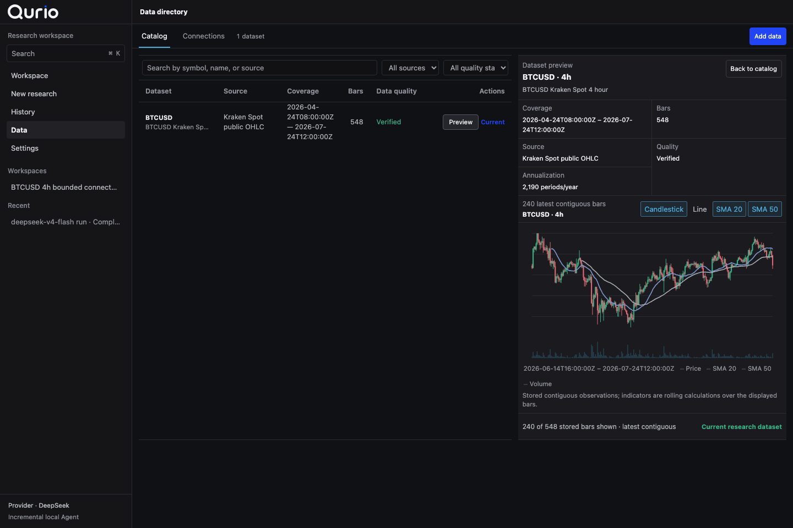
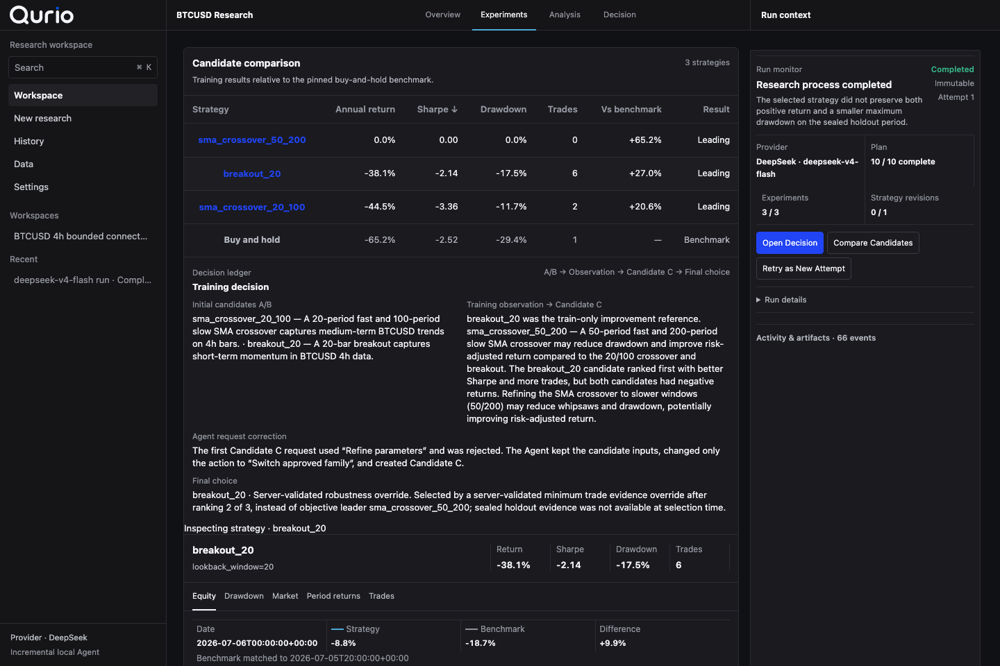
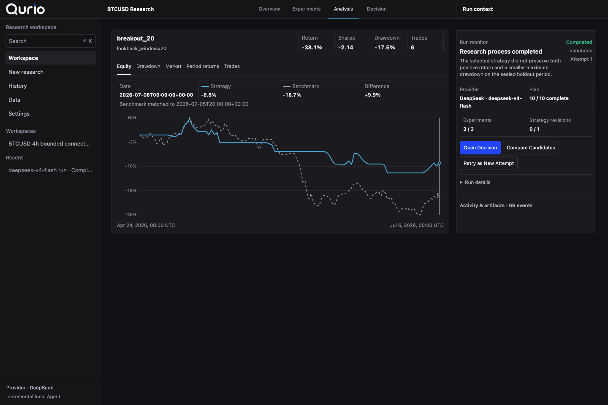
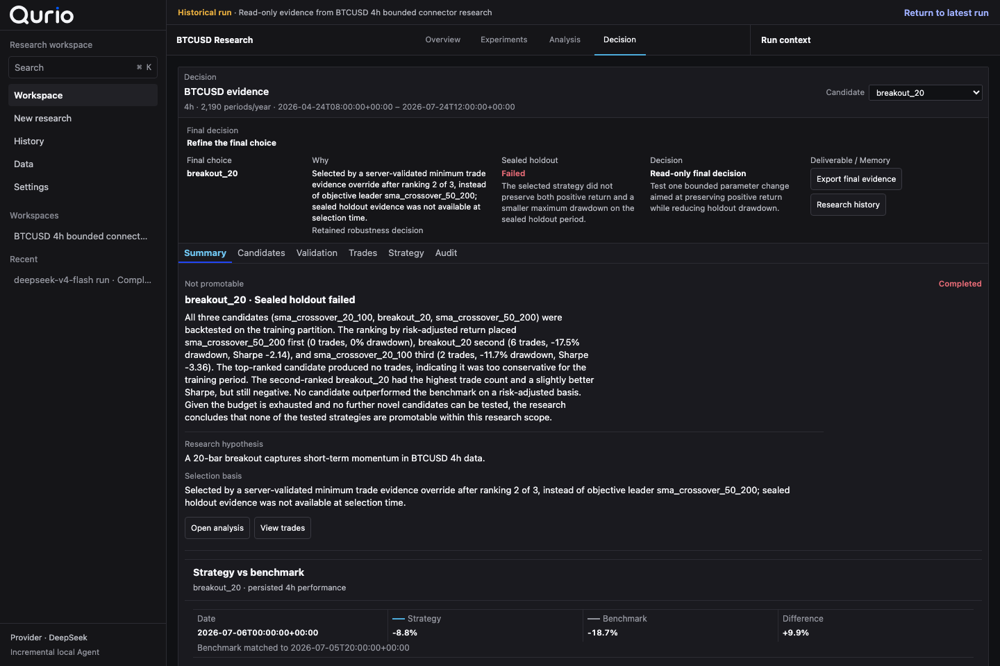

<p align="center">
  <picture>
    <source media="(prefers-color-scheme: dark)" srcset="./apps/mac/public/brand/qurio-wordmark-inverse.svg">
    <source media="(prefers-color-scheme: light)" srcset="./apps/mac/public/brand/qurio-wordmark.svg">
    
  </picture>
</p>

<p align="center"><strong>Research a market idea, compare what survives, and keep the evidence.</strong></p>

<p align="center">
  A quantitative research workspace where plans, experiments, decisions, and evidence stay
  connected.
</p>

<p align="center">
  <a href="#what-is-this-really">What it is</a> ·
  <a href="#a-look-inside">Screens</a> ·
  <a href="#two-runs-worth-reading">Cases</a> ·
  <a href="#try-the-retained-demo">Demo</a> ·
  <a href="#build-qurio">Build</a>
</p>

[](./docs/portfolio/qurio-90-second-mainline.webm)

<p align="center"><em>A retained research run, from comparison to the next defensible action. Click to watch the 90-second demo.</em></p>

## What is this, really?

Qurio is a macOS workspace for doing quantitative research as a sequence you can revisit:
bring in market data, state a bounded objective, approve a plan, compare experiments, inspect
the result, and continue from the retained evidence.

One Research Agent proposes a bounded plan, registered tools keep each action inside the approved
scope, and retained evidence determines the next legal step. One deterministic evaluator
calculates every quantitative metric. The model can change the research path; it cannot quietly
change the math.

Not a crystal ball. It is a place to find out which ideas survive contact with data.

## What you do in Qurio

1. **Keep the dataset.** Import CSV data or use an allowlisted provider at `1h`, `4h`, or `1D`,
   with its source and assumptions attached.
2. **State the question.** Define a bounded objective, constraints, comparison rule, and action
   budget.
3. **Approve the plan.** See what the Agent intends to test before the run begins.
4. **Watch the research adapt.** Follow candidate experiments, rejected actions, typed repairs,
   observations, and the next legal step.
5. **Compare before concluding.** Inspect candidates under the same research context and open the
   sealed holdout once.
6. **Continue without starting over.** Reopen history or create a linked research version from the
   evidence already retained.

## A look inside

<table>
  <tr>
    <td width="50%">
      
      <br>
      <sub>Bring a dataset in, with its source and assumptions attached.</sub>
    </td>
    <td width="50%">
      
      <br>
      <sub>Compare candidates with the same research context.</sub>
    </td>
  </tr>
  <tr>
    <td width="50%">
      
      <br>
      <sub>Inspect the result, the benchmark, and why the candidate was selected.</sub>
    </td>
    <td width="50%">
      
      <br>
      <sub>Keep the run, decisions, and evidence together.</sub>
    </td>
  </tr>
</table>

Fewer “trust me” charts. More runs you can inspect.

## How a research run unfolds

```text
Objective → Approved plan → Experiments → Observation → Adaptation
    ↑                                                     ↓
Continue / Revise ← Sealed holdout ← Decision ← Comparison
```

That loop lives inside the product flow:

```text
Data → Research → Compare → Analyze → Continue / History
```

- **Data** retains immutable CSV or allowlisted provider datasets.
- **Research** keeps the approved contract, action budget, experiments, repairs, and Decision
  Ledger together.
- **Compare** puts candidate identity, deterministic metrics, walk-forward evidence, and
  differences in one view.
- **Analyze** shows equity, drawdown, market context, trades, and the sealed-holdout conclusion.
- **Continue / History** creates a linked research version or reopens retained evidence read-only.

The Agent only receives training evidence while it adapts. After the final candidate is selected,
Qurio opens one fresh sealed holdout. If the candidate fails, `revise_research` is a valid
conclusion—not an error to hide.

<details>
<summary><strong>Open the Agent architecture</strong></summary>


One Agent is intentional: the observation → adaptation → decision chain stays readable, while
registered tools and action budgets keep the approved scope explicit.

</details>

## Two runs worth reading

### Kraken / BTCUSD: the Agent changed course and still said “no”

This is the canonical reliability case: a retained engineering run with live market data and a
real DeepSeek decision provider, not a scripted fixture.

| What happened | Retained evidence |
|---|---|
| Data | 548 closed Kraken Spot `BTCUSD · 4h` bars; the open bar was dropped |
| Experiments | SMA 20/100, breakout 20, then an evidence-led SMA 50/200 candidate |
| Repair | The first call for candidate C was rejected; the next model turn corrected only the invalid action |
| Selection | Training ranked C first, but deterministic minimum-trade evidence selected B |
| Holdout | B failed the fresh sealed holdout; the retained next step is `revise_research` |

[Read the case study](./docs/portfolio/QURIO_KRAKEN_DEEPSEEK_CASE_STUDY.md) ·
[Inspect the sanitized evidence](./docs/portfolio/evidence/qurio-v1-kraken-deepseek.json) ·
[See the holdout decision](./docs/assets/pokiequant/v1-final-183209-04-holdout-revise-1440x960.png)

The case demonstrates the Agent/evaluator boundary, a typed repair, and an inspectable negative
conclusion. It does not claim alpha, profitability, production reliability, or user demand.

### Wind / CSI300: professional data, same retained path

An authorized Wind CSI300 daily export followed the same Data → Research → Continue / History
path with explicit `XSHG` session semantics and DeepSeek decisions. This is a validated
professional-dataset ingestion example—not a Wind API, real-time feed, alpha, or investment
recommendation claim.

[Read the supplemental case](./docs/portfolio/QURIO_WIND_DEEPSEEK_CASE_STUDY.md) ·
[Inspect the sanitized evidence](./docs/portfolio/evidence/qurio-wind-csi300-deepseek.json)

## Where the boundary is

This is a description of the product today, not a promise-shaped roadmap.

| Works today | Not yet | Deliberately not |
|---|---|---|
| Import retained research datasets | Live market streaming | A Bloomberg-style terminal |
| Run bounded quantitative experiments | Production trading execution | A black-box signal generator |
| Compare candidates under one context | Full market-terminal workflows | Arbitrary uploaded strategy code |
| Review evidence and history | Frictionless notarized public distribution | An Agent marketplace or swarm |
| Continue a previous research run | Production-scale reliability claims | A system that hides assumptions behind a score |

Markets are complicated. At least the experiment log can be tidy.

## Try the retained demo

Prerequisites: Python 3.12, Node.js 22, pnpm 10.28.0, and `uv` 0.11.28.

```bash
uv sync --locked --extra test
pnpm install --frozen-lockfile
.venv/bin/python scripts/launch_quant_live_session.py --guided-demo
```

Open the printed Mac UI URL and choose **Open guided demo**. Qurio verifies the retained database
digest, prepares a current-schema presentation copy, and serves that copy read-only. No provider
credential or new model call is required.

The guided-demo database contains no provider credential. Its SHA-256 is documented in
[the evidence README](./docs/portfolio/guided-demo/README.md).

The 90-second video uses a complementary Binance case where a real `deepseek-chat` run completed
the same bounded loop and passed one sealed holdout. The Kraken case remains canonical because its
repair and negative conclusion reveal more of the system boundary.

## Build Qurio

Package the Apple-silicon macOS 11+ application:

```bash
pnpm package:mac
```

The application embeds its FastAPI API and Research Agent worker, stores optional provider
credentials in Keychain, and supports a no-key deterministic demo. Developer ID signing and Apple
notarization are still required before frictionless public distribution.

<details>
<summary><strong>Run the focused verification gates</strong></summary>

```bash
.venv/bin/ruff check .
.venv/bin/ruff format --check .
.venv/bin/pyright
.venv/bin/pytest tests/runtime/test_migration_history.py
pnpm lint
pnpm typecheck
pnpm test
pnpm build
```

The full CI also exercises contract, integration, security, evaluation, license, E2E, Cargo, and
macOS-native application boundaries. Live provider credentials are not required.

</details>

## For a deeper review

- [90-second review guide](./docs/portfolio/QURIO_90_SECOND_DEMO.md)
- [Technical tradeoffs](./docs/portfolio/QURIO_TECHNICAL_TRADEOFFS.md)
- [Product contract](./apps/mac/PRODUCT.md)
- [Interface contract](./apps/mac/DESIGN.md)
- [Capability inventory](./docs/POKIEQUANT_CAPABILITY_INVENTORY.md)
- [Portfolio release checklist](./docs/portfolio/QURIO_PORTFOLIO_RELEASE_CHECKLIST.md)
- [Implementation history](./docs/IMPLEMENTATION_HISTORY.md)
- [Third-party notices](./THIRD_PARTY_NOTICES.md)

Qurio is the current product and UI brand. Historical `Glint`, `PokieQuant`, and `@glint/*` names
remain in inherited infrastructure and compatibility contracts; they are not separate products.
