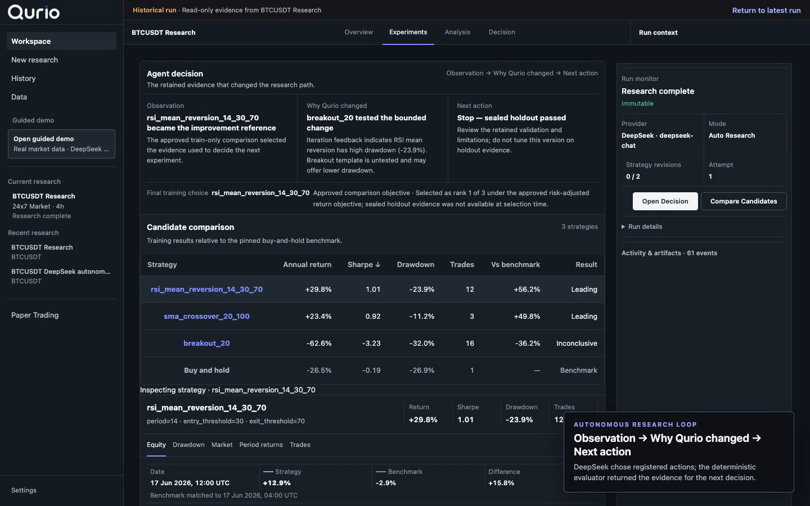
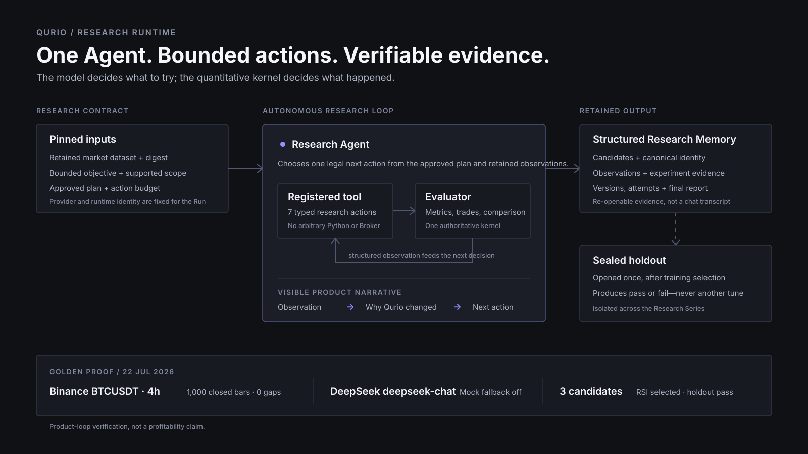

# Qurio

**A verifiable autonomous Research Agent for quantitative research.**

Qurio turns a bounded market question into an approved plan, comparable experiments,
evidence-led adaptation, a sealed-holdout decision, and a research history that can be
reopened. The model chooses research actions; one deterministic evaluator owns every
quantitative metric.

[](./docs/portfolio/qurio-90-second-mainline.webm)

## What makes the Agent verifiable

- **Real decisions, bounded tools.** One Research Agent can use seven registered tools.
  It cannot execute arbitrary Python, shell commands, broker actions, or hidden strategy code.
- **Evidence changes the plan.** Candidate experiments are retained with observations,
  rejected tool calls, repairs, comparisons, and the final selection rationale.
- **Failure remains a valid result.** The Agent never sees the sealed holdout while adapting.
  If the selected candidate fails it, Qurio concludes `revise_research` instead of presenting
  a profitable-looking result.

## Canonical case: the Agent changed course and still said “no”

The primary portfolio case is a retained live engineering run, not a scripted fixture:

| Boundary | Retained evidence |
|---|---|
| Market data | 548 closed Kraken Spot `BTCUSD · 4h` bars; the current open bar was dropped |
| Decision provider | DeepSeek `deepseek-v4-flash`; Mock fallback disabled |
| Experiments | A: SMA 20/100, B: breakout 20, C: SMA 50/200 |
| Repair | Candidate C's first tool call was rejected; the next model turn corrected only the invalid replan action |
| Selection | Training ranked C, B, A; deterministic minimum-trade evidence overrode zero-trade C and selected B |
| Holdout | B failed the fresh sealed holdout; the retained next step is `revise_research` |

This demonstrates a complete Agent/evaluator boundary and an inspectable correction. It does
**not** claim alpha, profitability, production reliability, or user demand.

- [Read the case study](./docs/portfolio/QURIO_KRAKEN_DEEPSEEK_CASE_STUDY.md)
- [Inspect the sanitized evidence](./docs/portfolio/evidence/qurio-v1-kraken-deepseek.json)
- [See the repair in the Decision Ledger](./docs/assets/pokiequant/v1-final-183209-02-ledger-repair-1440x960.png)
- [See the holdout failure and next action](./docs/assets/pokiequant/v1-final-183209-04-holdout-revise-1440x960.png)

## Review Qurio in 90 seconds

1. [Watch the retained end-to-end demo](./docs/portfolio/qurio-90-second-mainline.webm).
2. [Open the Agent architecture](./docs/portfolio/QURIO_AGENT_ARCHITECTURE.svg).
3. [Read the technical tradeoffs](./docs/portfolio/QURIO_TECHNICAL_TRADEOFFS.md).
4. [Inspect the live Kraken/DeepSeek evidence](./docs/portfolio/evidence/qurio-v1-kraken-deepseek.json).
5. [Run the read-only guided demo](./docs/portfolio/QURIO_90_SECOND_DEMO.md).

The existing 90-second video uses the complementary Binance case, where a real
`deepseek-chat` run completed the same bounded loop and passed one sealed holdout. The Kraken
case above is the canonical reasoning-and-repair example because its negative conclusion is
more diagnostic of the system boundary.

## System boundary



```text
retained market data
        ↓
bounded objective → approved plan
        ↓
Research Agent → registered research tools
        ↓
deterministic evaluator → experiments and comparisons
        ↓
train-only adaptation → final candidate selection
        ↓
single sealed holdout
        ↓
conclude / revise / continue with structured lineage
```

Qurio uses one Agent intentionally. A single decision-maker makes the
observation → adaptation → decision chain easier to inspect than a swarm, while registered
tools and hard action budgets keep scope explicit.

## Product loop

```text
Data → Research → Compare → Analyze → Continue / History
```

- **Data:** immutable CSV or allowlisted provider datasets at `1h`, `4h`, and `1D`.
- **Research:** an approved contract, action budget, experiments, repairs, and decision ledger.
- **Compare:** candidate identity, deterministic metrics, walk-forward evidence, and differences.
- **Analyze:** equity, drawdown, market context, trades, and the sealed-holdout conclusion.
- **Continue / History:** a new research version or a read-only reopen of retained evidence.

## Reproduce the portfolio demo

Prerequisites: Python 3.12, Node.js 22, pnpm 10.28.0, and `uv` 0.11.28.

```bash
uv sync --locked --extra test
pnpm install --frozen-lockfile
.venv/bin/python scripts/launch_quant_live_session.py --guided-demo
```

Open the printed Mac UI URL and choose **Open guided demo**. Qurio verifies the retained
database digest, prepares a current-schema presentation copy, and serves the copy read-only.
No Provider credential or new model call is required.

The retained guided-demo database contains no Provider credential. Its SHA-256 is documented
in [the evidence README](./docs/portfolio/guided-demo/README.md).

## Verify the implementation

Focused local gates:

```bash
.venv/bin/ruff check .
.venv/bin/ruff format --check .
.venv/bin/pyright
.venv/bin/pytest tests/runtime/test_migration_history.py
pnpm lint
pnpm typecheck
pnpm test
pnpm build
```

The full CI also exercises contract, integration, security, evaluation, license, E2E, Cargo,
and macOS-native application boundaries. Live Provider credentials are not required.

## Build the macOS application

```bash
pnpm package:mac
```

The current distributable target is Apple-silicon macOS 11+. The application embeds its
FastAPI API and Research Agent worker, stores optional Provider credentials in Keychain, and
supports a no-key deterministic demo. Developer ID signing and Apple notarization are still
required before frictionless public distribution.

## Scope and contribution boundary

Qurio is the current product and UI brand. The repository retains historical `Glint`,
`PokieQuant`, and `@glint/*` names in inherited infrastructure and compatibility contracts.
Those names are not separate product concepts.

The portfolio claim is deliberately limited to the Qurio quantitative-research loop, its
Agent/evaluator contract, retained evidence, desktop integration, and verification path.
The repository does not claim:

- live or paper-broker execution;
- arbitrary uploaded strategy code;
- a multi-Agent marketplace or Agent Builder;
- statistically validated future alpha;
- production-scale reliability or completed user-demand validation.

For deeper review:

- [Product contract](./apps/mac/PRODUCT.md)
- [Interface contract](./apps/mac/DESIGN.md)
- [Capability inventory](./docs/POKIEQUANT_CAPABILITY_INVENTORY.md)
- [DeepSeek application and interview brief（中文）](./docs/portfolio/QURIO_DEEPSEEK_APPLICATION_BRIEF_ZH.md)
- [Portfolio release checklist](./docs/portfolio/QURIO_PORTFOLIO_RELEASE_CHECKLIST.md)
- [Implementation history](./docs/IMPLEMENTATION_HISTORY.md)
- [Third-party notices](./THIRD_PARTY_NOTICES.md)
