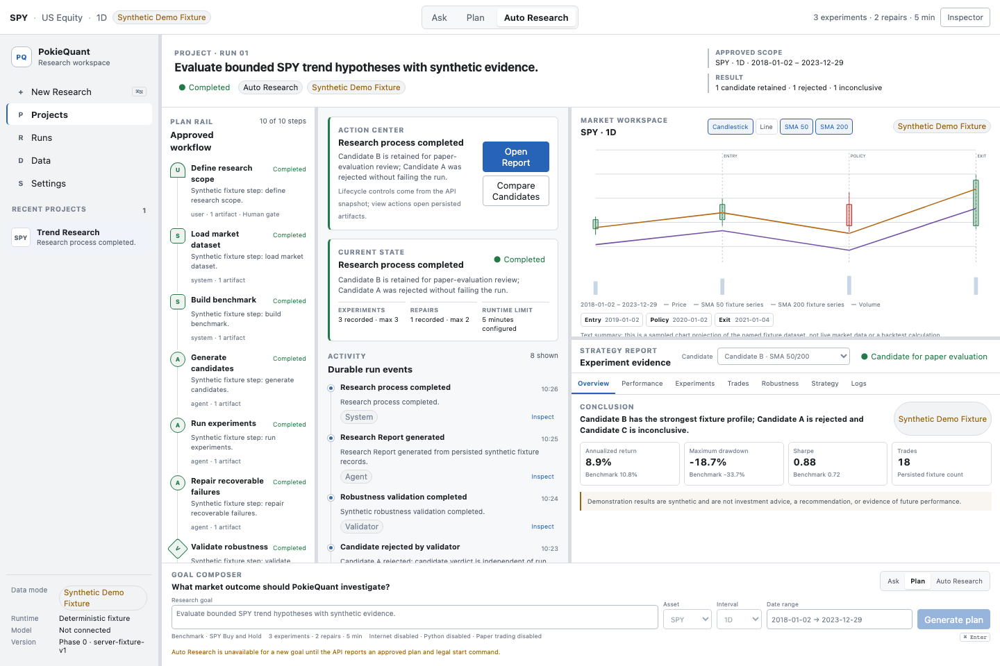
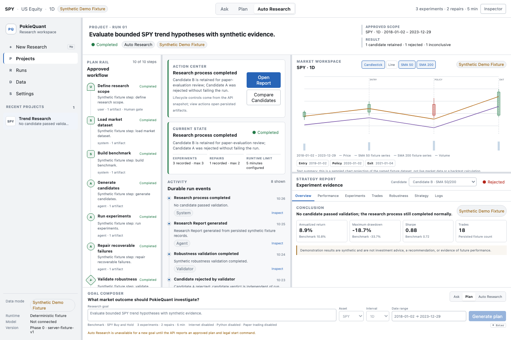

# PokieQuant

PokieQuant is a governed desktop workspace for bounded, auditable quantitative-research workflows.

Phase 1A adds an incremental autonomous research loop over the Phase 0 shell. Runs use either the
default **Synthetic Demo Fixture** or a workspace-imported, digest-pinned daily OHLCV CSV. Agent runs
select dynamic strategy parameters and compute their metrics with the pure local daily-bar kernel.
The model boundary can choose only one of seven registered tools; it cannot execute Python, shell,
broker, or order actions. Separate server-owned adapters can retrieve bounded Binance Spot or
Nasdaq-listed equity data before a Run, but this network capability is never exposed as an Agent
tool.

## Phase 0 status

The current working tree is an integration candidate, not a production release.

Implemented:

- independent Quant contracts, enums, safe event payloads, SSE encoding, and OpenAPI registration;
- authenticated, workspace-scoped `/v1/quant` project/run, approval, cancellation, retry, event, artifact, and experiment routes;
- a server-owned deterministic workspace fixture with ten named E2E states;
- a canonical deterministic runtime script covering Candidate B's recoverable candidate-scoped failure and repair, no-viable-candidate, failed-safe, and cancellation paths;
- PostgreSQL/SQLAlchemy-backed, workspace-scoped Phase 0 aggregate and fixture snapshot state, including refresh/restart recovery and optimistic concurrency;
- a registered `quant-fixture` worker path with lease, heartbeat, fencing, stale-claim rejection, and cancellation fence invalidation;
- Mac navigation, Plan/Activity/Market/Strategy Report/Inspector surfaces, visible authenticity labels, and read-only policy status;
- Mac lifecycle commands routed through the authenticated API snapshot adapter; React does not assign run state;
- a usable synthetic Agent path: persist a custom research goal, generate and approve a plan, trigger the bounded kernel only from the approved run command, review its report, complete the run, and recover the same state after refresh;
- immutable daily-bar contracts with canonical digest validation plus a pure long/cash SMA, RSI, breakout, and Buy-and-Hold kernel using close-signal/next-open execution and explicit costs;
- a truthful API/UI engine evidence card and computed candidate/report projection over 1,564 digest-pinned synthetic weekday bars;
- tests that keep candidate rejection separate from run failure and assert that the fixture runtime imports no network, process, or arbitrary-execution facilities.
- strict one-action Agent contracts, goal-aware Mock behavior, an OpenAI-compatible DeepSeek
  provider, dynamic candidates, and one fenced tool action per worker poll;
- persisted Agent iterations, experiment/repair budgets, decisions, observations, local-kernel
  metrics, comparisons and reports that recover after process restart.
- strict CSV OHLCV normalization, immutable content-addressed dataset versions, workspace-scoped
  import/list APIs, a 252-daily-bar minimum for autonomous execution, and Run-level dataset
  ID/digest pinning retained across retries.
- a Mac Data workspace that imports daily OHLCV CSV files, lists immutable versions, exposes
  provenance and eligibility, and pins the selected dataset into a new Auto Research run.
- a sealed chronological 80/20 evaluation boundary: the Agent creates, revises, and compares
  candidates using only training metrics; the selected candidate is evaluated on holdout bars only
  when the final report is frozen, with both partitions visible in the Mac Strategy Report.
- declared immutable CSV source metadata, including provider/reference, adjustment policy, submitted
  text digest, parser version, normalized market-data digest, and Run/report provenance.
- deterministic three-fold expanding walk-forward evidence inside the training partition, alongside
  the separately sealed final holdout evaluation.
- a digest-pinned data-quality report covering declared market calendar/timezone compatibility,
  missing weekdays, excessive gaps, unexpected weekend sessions, zero volume, large price jumps,
  and adjustment-policy limitations; blocking findings retain the import but prevent Auto Research.
- training-only market-regime labels for every walk-forward fold, computed strictly from history
  before that fold's evaluation window and summarized without opening the final holdout.
- a fixed-host, credential-free Binance Spot daily-kline adapter for `BTCUSDT`-style symbols, with
  raw-response digest, retrieval timestamp, request/return/drop counts, UTC 24×7 quality checks,
  normalized immutable dataset digest, API route, Mac fetch controls, and retained provider proof.
- a fixed-host Nasdaq equity adapter that retrieves provider-listed instrument information,
  unadjusted historical OHLCV and dividend history as three separately hashed responses; XNAS
  quality checks exclude regular full-day US exchange holidays while retaining special-closure
  warnings, and unavailable split verification remains explicit in API and Mac evidence.

Still intentionally not implemented:

- provider adapters beyond public Binance Spot and Nasdaq-listed US equities, or news data;
- exchange-holiday/corporate-action reference verification, production backtest orchestration,
  broad parameter search, or optimization (manual CSV provenance remains user-supplied);
- nested cross-validation, broad regime coverage, statistical significance testing, or production
  strategy certification; regime diversity is reported truthfully and may be insufficient;
- Spark/Jupyter/sandbox or uploaded-code execution;
- providers other than the optional DeepSeek-compatible decision endpoint; the decision provider
  never receives market-network or arbitrary execution tools;
- paper or live trading, broker credentials, order routing, or portfolio execution;
- PokieTicker or Spark code migration (both remain blocked on repository, immutable commit, license, and security review);
- a normalized production Quant research schema, multi-worker throughput/SLO validation, and long-running lease cadence. Phase 0 intentionally persists its synthetic aggregate in one workspace-scoped JSON document; it is durable but is not presented as the future market/backtest schema.

The retained Glint modules remain in the repository as inherited infrastructure, but the main Mac path is PokieQuant and does not map Signals, Investigations, Evidence, Claims, Synthesis, or Decision Briefs into financial objects.

## Fixture states

`POKIEQUANT_E2E_RUN_STATE` is server-side development/E2E configuration only. It is not exposed as a production UI control.

```text
quant-ready
quant-plan-approval
quant-running
quant-repairing
quant-validating
quant-waiting-review
quant-completed
quant-no-viable-candidate
quant-failed-safe
quant-cancelled
```

The canonical negative result is a healthy completed process with a retained Research Report:

```text
Run state: completed
Conclusion: No candidate passed validation
```

A rejected candidate or a recoverable candidate experiment failure does not make the run `failed`.

## Reviewed workbench captures

Playwright captures the real 1440×960 React workbench against the loopback fixture API. The checked evidence set covers Ready, Plan Approval, Running, Repairing, Completed, and No Viable Candidate.





## Local setup

Prerequisites: Python 3.12, Node.js, pnpm 10.28.0, and the dependencies already locked by this repository.

```bash
uv sync --locked --extra test
pnpm install --frozen-lockfile
```

The Mac client requires the inherited secure session configuration and an API process:

```bash
VITE_GLINT_API_URL=http://127.0.0.1:8000 \
VITE_GLINT_WORKSPACE_ID=<workspace-uuid> \
VITE_GLINT_ACCESS_TOKEN=<development-token> \
pnpm --filter @glint/mac dev
```

The `VITE_GLINT_*` environment names and `@glint/*` package identifiers are retained compatibility names; they are not product-domain aliases.

Run the API and the default no-key autonomous Agent:

```bash
uvicorn services.api.app.main:app --host 127.0.0.1 --port 8000

POKIEQUANT_AGENT_PROVIDER=mock \
GLINT_WORKSPACE_ID=<workspace-uuid> \
python -m services.worker.app.main poll --kind quant-agent --interval-seconds 0.5
```

Use DeepSeek for one-action decisions (tool execution remains local and deterministic):

```bash
POKIEQUANT_AGENT_PROVIDER=deepseek \
DEEPSEEK_API_KEY=<key> \
POKIEQUANT_AGENT_MODEL=deepseek-v4-flash \
GLINT_WORKSPACE_ID=<workspace-uuid> \
python -m services.worker.app.main poll --kind quant-agent --interval-seconds 1
```

Run the opt-in imported-data DeepSeek verification without placing a credential on the command line:

```bash
set -a; source .env.local; set +a
GLINT_ENVIRONMENT=test \
GLINT_DATABASE_URL=sqlite:////tmp/pokiequant-deepseek.db \
POKIEQUANT_AGENT_MODEL=deepseek-v4-flash \
python scripts/verify_quant_deepseek_run.py
```

Run the complete real-provider path (public Binance BTCUSDT daily data, then DeepSeek decisions):

```bash
set -a; source .env.local; set +a
python scripts/verify_quant_binance_deepseek_run.py
```

Run the Nasdaq-listed equity path (AAPL history and dividends, then DeepSeek decisions):

```bash
set -a; source .env.local; set +a
python scripts/verify_quant_nasdaq_deepseek_run.py
```

## Verification

Run the additive Phase 0 gate:

```bash
./scripts/verify_pokiequant_shell.sh
```

Regenerate the checked browser and Mac fixture projections after changing the
server-owned fixture contract:

```bash
python3 scripts/generate_quant_workspace_fixtures.py
```

The gate checks Quant contracts, API, runtime fixtures, OpenAPI drift, Mac lint/typecheck/unit/build, license/provenance boundaries, fixture labels, disabled capability claims, and removal of active Glint product-intelligence copy from the main path. It does not enable live connector or model smoke tests.

To reproduce the six reviewed screenshots:

```bash
mkdir -p docs/assets/pokiequant
for state in quant-ready quant-plan-approval quant-running quant-repairing quant-completed quant-no-viable-candidate; do
  GLINT_E2E_API_MODE=fixture \
  POKIEQUANT_E2E_RUN_STATE="$state" \
  POKIEQUANT_CAPTURE_SCREENSHOTS=1 \
  pnpm --dir apps/mac exec playwright test e2e/quant-workspace.spec.ts \
    -g 'captures a real workbench screenshot'
done
```

Inherited gates remain available and are not weakened:

```bash
./scripts/verify_phase1.sh
./scripts/verify_phase2.sh
./scripts/verify_phase3_quality.sh
./scripts/verify_tauri_runtime.sh
```

## Architecture boundary

```text
authenticated workspace session
  -> FastAPI /v1/quant projects, runs, plans and commands
  -> durable workspace-scoped Quant repository
  -> fenced incremental quant-agent worker (one decision/tool per poll)
  -> fixed tool registry and pure local daily-bar kernel
  -> typed Quant transport and pure presentation projection
  -> React/Tauri workspace
```

The API owns lifecycle and legal commands. The worker owns fenced fixture execution and the
incremental seven-tool Agent loop. The Mac client owns selection, layout, disclosure, and other
presentation preferences.

See `docs/POKIEQUANT_PRODUCT_SPEC.md`, `docs/POKIEQUANT_STATE_MATRIX.md`, and `docs/POKIEQUANT_REFERENCE_AUDIT.md` for the product, state, provenance, and license contracts.
