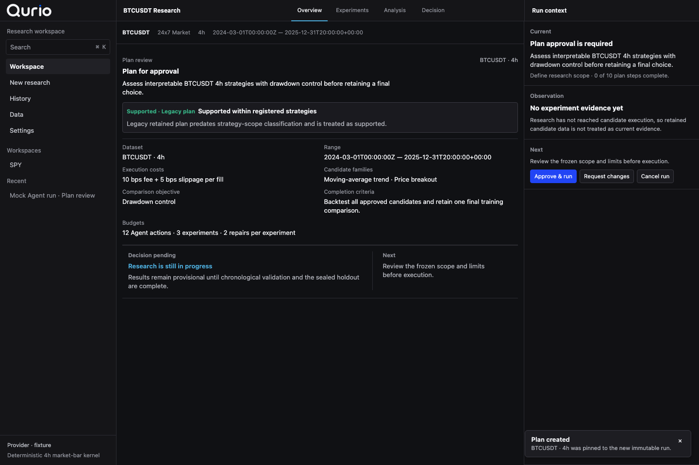
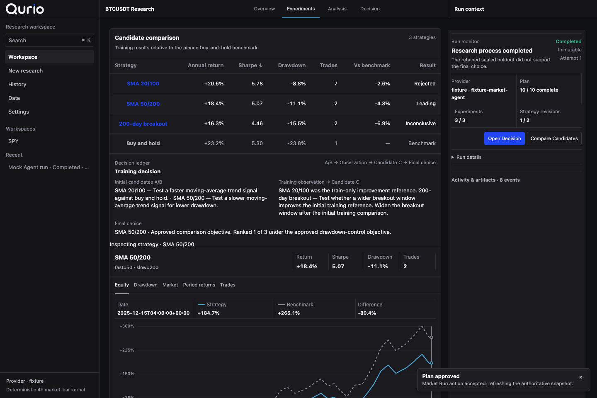
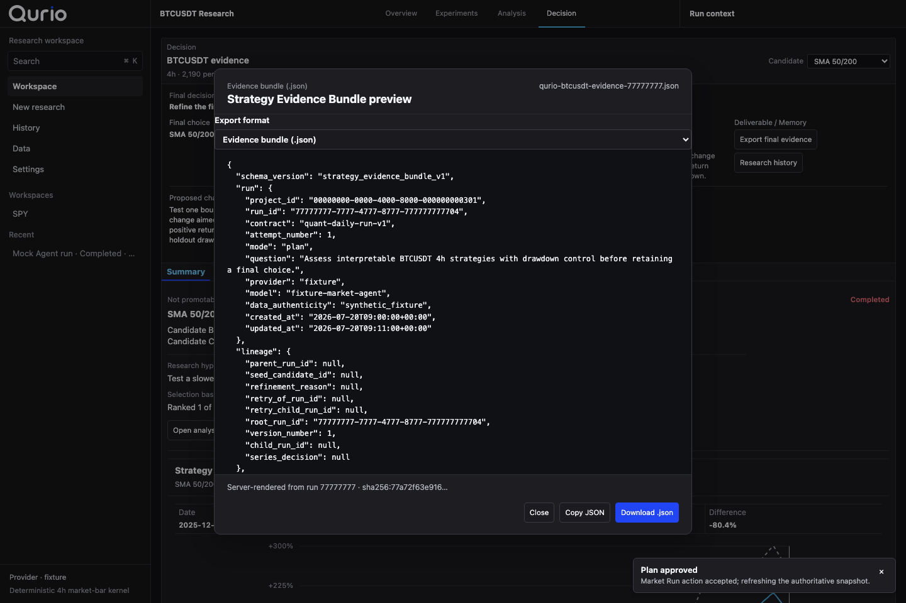
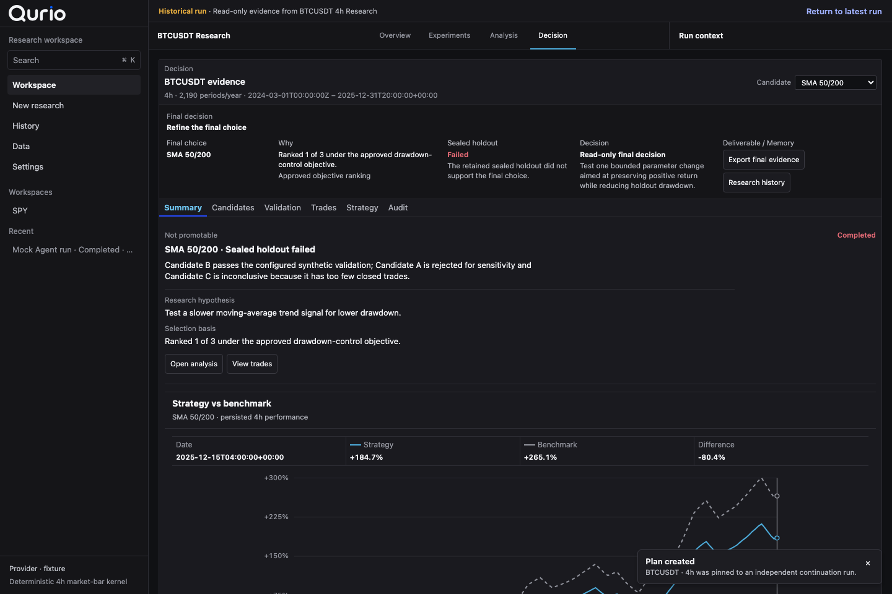
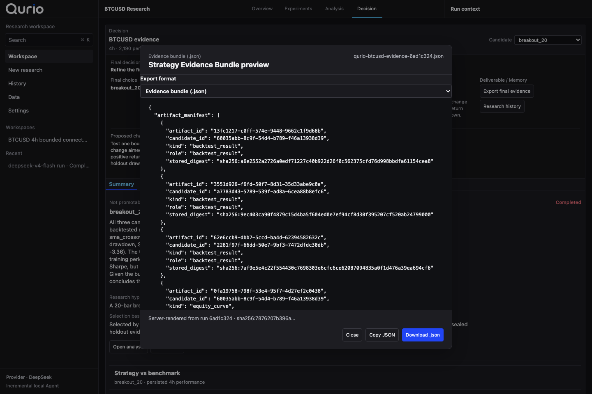

# Qurio — implementation history

Qurio is an AI-native quant research workspace powered by one verifiable autonomous Research Agent. It turns a bounded investment idea into comparable evidence, supports continuation from retained results, and can hand a sealed-holdout pass into an isolated Paper simulation; it is not an Agent Builder, broker, or live-trading platform.

This repository retains the historical name **PokieQuant** in paths, implementation documents, contracts, and earlier phase records. PokieQuant is not the current product or UI brand. Product-facing work must use the canonical Qurio assets documented in [`apps/mac/public/brand/README.md`](../apps/mac/public/brand/README.md).

The bounded Data → Research → Compare → Analyze → Continue / History mainline is complete for the legacy daily path and market-v2 `1h`, `4h` and `1D` research. W2-lite Evidence Focus, W3 train-only robustness sensitivity, R1/R2-lite validator-backed repair learning, E0's server-authored JSON evidence bundle and the focused P1-C golden visual proof are implemented. Real C5 verification covers Binance BTCUSDT `4h` and `1D`; deterministic fixtures cover `1h` and the complete portfolio workflow.

D1 adds a server-listed, fixed-host, credential-free Kraken Spot OHLC connector for allowlisted BTC/ETH USD/USDT pairs at `4h` and `1D`. Untrusted provider rows enter the existing native validation and canonical market-v2 persistence path. Deterministic browser and backend contract/API coverage pass; a live no-key read-only smoke on 2026-07-24 verified both intervals, including the 721-row response boundary and removal of the current uncommitted bar. The model boundary remains one Research Agent with seven registered tools and structured `template + parameters + canonical key` strategy identity; it cannot execute arbitrary Python, shell, broker or order actions.

V1 now proves that boundary end to end with one retained live engineering run in
`.run/v1-kraken-deepseek-20260724-183209`: Kraken BTCUSD `4h` provided 548 closed bars (one
current bar dropped), DeepSeek `deepseek-v4-flash` ran live with Mock fallback disabled, and the
server retained an `A/B → C → decision` outcome. Three experiments ran:
A `sma_crossover_20_100`, B `breakout_20`, and C `sma_crossover_50_200`. The first Candidate C
create call was rejected once with `ITERATION_REPLAN_TEMPLATE_RELATION_INVALID`; the next model
turn received the exact rejected arguments, changed only `replan_decision.action` to
`switch_approved_family`, and succeeded. Exactly one failed tool call was recorded, with no
repetition and a durable `quant-learning-trace-v1` whose `correction_delta` contains only that
action. Candidate C was backtested and included in a second train-only comparison; the final
training ranking was C, B, A. Because C produced zero training trades, the structured
`research_decision` selected B `breakout_20` via `robustness_override` / `minimum_trade_evidence`
while referencing C. This is a minimum-trade evidence selection, not an alpha or profitability
claim. B then failed the fresh sealed holdout, so the retained next step is `revise_research`,
not promotion. Current and historical snapshots retained the same dataset, Run, split, selected
candidate and E0 JSON identities; E0 is
`.run/v1-kraken-deepseek-20260724-183209/qurio-btcusd-evidence-6ad1c324.json`. The run completed
with 11 Agent iterations, 3 used experiments, no provider fallback and no provider decision
failure. Sanitized evidence is committed at
[`portfolio/evidence/qurio-v1-kraken-deepseek.json`](./portfolio/evidence/qurio-v1-kraken-deepseek.json). This is engineering evidence
of the connector/model/workflow boundary, not an alpha, profitability, production-reliability or
user-demand claim. S0-lite Strategy Scope is complete: plans now classify requests as
supported, bounded proxies that require explicit approval, or unsupported requests that retain
zero experiments and holdout evidence. Plan-external candidate calls return a typed coupled
template/parameter repair and retain its resolved or stopped learning trace across restore. The
constrained strategy-execution SDK remains deferred. A separate read-only Python SDK, CLI and
bounded MCP server expose retained datasets, Runs and evidence without adding another research or
execution path.

The Phase 0 and Phase 1A material below is retained as implementation history. Current capability and next-direction truth lives in [the capability inventory](./POKIEQUANT_CAPABILITY_INVENTORY.md), with product and layout boundaries in [PRODUCT.md](../apps/mac/PRODUCT.md) and [DESIGN.md](../apps/mac/DESIGN.md).

## Phase 0 status

The current working tree is an integration candidate, not a production release.

Implemented:

- independent Quant contracts, enums, safe event payloads, SSE encoding, and OpenAPI registration;
- authenticated, workspace-scoped `/v1/quant` project/run, approval, cancellation, retry, event, artifact, and experiment routes;
- a server-owned deterministic workspace fixture with eleven named E2E states;
- a canonical deterministic runtime script covering Candidate B's recoverable candidate-scoped failure and repair, no-viable-candidate, failed-safe, and cancellation paths;
- PostgreSQL/SQLAlchemy-backed, workspace-scoped Phase 0 aggregate and fixture snapshot state, including refresh/restart recovery and optimistic concurrency;
- a registered `quant-fixture` worker path with lease, heartbeat, fencing, stale-claim rejection, and cancellation fence invalidation;
- Mac navigation, Plan/Activity/Market/Strategy Report/Inspector surfaces, visible authenticity labels, and read-only policy status;
- Mac lifecycle commands routed through the authenticated API snapshot adapter; React does not assign run state;
- a usable synthetic Agent path: persist a custom research goal, generate and approve a plan, trigger the bounded kernel only from the approved run command, review its report, complete the run, and recover the same state after refresh;
- immutable daily-bar contracts with canonical digest validation plus a pure long/cash SMA, RSI, breakout, and Buy-and-Hold kernel using close-signal/next-open execution and explicit costs;
- a truthful API/UI engine evidence card and computed candidate/report projection over 1,564 digest-pinned synthetic weekday bars;
- tests that keep candidate rejection separate from run failure and assert that the fixture runtime imports no network, process, or arbitrary-execution facilities.
- strict one-action Agent contracts, goal-aware Mock behavior, an OpenAI-compatible DeepSeek
  provider, dynamic candidates, and one fenced tool action per worker poll;
- persisted Agent iterations, experiment/repair budgets, decisions, observations, local-kernel
  metrics, comparisons and reports that recover after process restart.
- strict CSV OHLCV normalization, immutable content-addressed dataset versions, workspace-scoped
  import/list APIs, a 252-daily-bar minimum for autonomous execution, and Run-level dataset
  ID/digest pinning retained across retries.
- a Mac Data workspace that imports daily OHLCV CSV files, lists immutable versions, exposes
  provenance and eligibility, and pins the selected dataset into a new Auto Research run.
- a sealed chronological 80/20 evaluation boundary: the Agent creates, revises, and compares
  candidates using only training metrics; the selected candidate is evaluated on holdout bars only
  when the final report is frozen, with both partitions visible in the Mac Strategy Report.
- declared immutable CSV source metadata, including provider/reference, adjustment policy, submitted
  text digest, parser version, normalized market-data digest, and Run/report provenance.
- deterministic three-fold expanding walk-forward evidence inside the training partition, alongside
  the separately sealed final holdout evaluation.
- a digest-pinned data-quality report covering declared market calendar/timezone compatibility,
  missing weekdays, excessive gaps, unexpected weekend sessions, zero volume, large price jumps,
  and adjustment-policy limitations; blocking findings retain the import but prevent Auto Research.
- training-only market-regime labels for every walk-forward fold, computed strictly from history
  before that fold's evaluation window and summarized without opening the final holdout.
- a fixed-host, credential-free Binance Spot daily-kline adapter for `BTCUSDT`-style symbols, with
  raw-response digest, retrieval timestamp, request/return/drop counts, UTC 24×7 quality checks,
  normalized immutable dataset digest, API route, Mac fetch controls, and retained provider proof.
- a fixed-host Nasdaq equity adapter that retrieves provider-listed instrument information,
  unadjusted historical OHLCV, dividend history, and a point-in-time split-calendar snapshot as
  four separately hashed responses; XNAS quality checks exclude regular full-day US exchange
  holidays while retaining special-closure warnings. Dividend coverage and split snapshot coverage
  remain separate, and the API/Mac UI explicitly avoid claiming historical split completeness.

Not implemented at the retained Phase 0 checkpoint below; current superseding capability is summarized above:

- provider adapters beyond public Binance Spot and Nasdaq-listed US equities, or news data;
- special exchange-closure and historically complete corporate-action reference verification,
  production backtest orchestration,
  broad parameter search, or optimization (manual CSV provenance remains user-supplied);
- nested cross-validation, broad regime coverage, statistical significance testing, or production
  strategy certification; regime diversity is reported truthfully and may be insufficient;
- Spark/Jupyter/sandbox or uploaded-code execution;
- providers other than the optional DeepSeek-compatible decision endpoint; the decision provider
  never receives market-network or arbitrary execution tools;
- live trading, broker credentials, live order routing, or production portfolio execution;
- PokieTicker or Spark code migration (both remain blocked on repository, immutable commit, license, and security review);
- a normalized production Quant research schema, multi-worker throughput/SLO validation, and long-running lease cadence. Phase 0 intentionally persists its synthetic aggregate in one workspace-scoped JSON document; it is durable but is not presented as the future market/backtest schema.

The retained Glint modules remain in the repository as inherited infrastructure, but the main Mac path is Qurio and does not map Signals, Investigations, Evidence, Claims, Synthesis, or Decision Briefs into financial objects.

## Fixture states

`POKIEQUANT_E2E_RUN_STATE` is server-side development/E2E configuration only. It is not exposed as a production UI control.

```text
quant-ready
quant-plan-approval
quant-running
quant-repairing
quant-validating
quant-waiting-review
quant-completed
quant-paper-pass
quant-no-viable-candidate
quant-failed-safe
quant-cancelled
```

The canonical negative result is a healthy completed process with a retained Research Report:

```text
Run state: completed
Conclusion: No candidate passed validation
```

A rejected candidate or a recoverable candidate experiment failure does not make the run `failed`.

## Reviewed workbench captures

Playwright's focused P1-C proof drives the actual Qurio React workbench against the deterministic loopback fixture API through Data → plan approval → live A/B → Observation/C adaptation → final JSON evidence export → Continue / History reopen. Six captures are 1440×960 and the export dialog also has a 1024×960 capture. This is UI and workflow evidence, not a live Binance, Kraken, DeepSeek or alpha claim.









### Final accepted live UI proof — 2026-07-24 18:32:09

The accepted retained UI E2E passed on the `A/B → C → decision` branch from the live Kraken/DeepSeek
session `.run/v1-kraken-deepseek-20260724-183209`. These six 1440×960 captures were produced by a
genuine SQLite read-only reopen: API + Mac UI only, no worker/model call. Data → Decision Ledger →
Analysis → Decision → E0 → History reopen all passed, and the retained DB SHA-256 stayed exactly
`9bc9986ba81496a14c862a7b23837bd8266b4766d73c2177578182c0569d90c0`.





## Local setup

Prerequisites: Python 3.12, Node.js, pnpm 10.28.0, and the dependencies already locked by this repository.

```bash
uv sync --locked --extra test
pnpm install --frozen-lockfile
```

For browser development, start the Mac client with the inherited compatibility
environment names and a running API:

```bash
VITE_GLINT_API_URL=http://127.0.0.1:8000 \
VITE_GLINT_WORKSPACE_ID=<workspace-uuid> \
VITE_GLINT_ACCESS_TOKEN=<development-token> \
pnpm --filter @glint/mac dev
```

The `VITE_GLINT_*` environment names and `@glint/*` package identifiers are retained compatibility names; they are not product-domain aliases.

The Apple-silicon macOS 11+ `Qurio.app` embeds its local FastAPI and Quant Agent
worker. End users do not need this repository, Python, Node or `.venv`. From
first launch or Settings, choose DeepSeek and a model, or Offline deterministic
for a no-key path. Qurio creates and reuses one workspace under macOS
Application Support, retains its session and optional DeepSeek credential in
Keychain, and reconnects automatically. Existing Runs retain their recorded
provider/model; changing the managed runtime requires a restart and is
unavailable while the current Run is active.

A fresh local workspace with no retained Runs opens directly in New research.
The bundled synthetic SPY dataset is visibly labelled as Offline demo data, so
the complete plan → approve → experiments → comparison → decision path can run
without a network or API key without presenting the fixture as market evidence.

Alternatively, enter an API URL, workspace ID and access token in the connection
screen. The non-secret endpoint and workspace are saved locally; the access
token remains in macOS Keychain. A remote or separately managed API must allow
the packaged `tauri://localhost` origin.

Release builds automatically create the relocatable runtime with managed Python
3.12.13 and locked dependencies, embed it into the app Resources directory,
apply an ad-hoc signature and produce a checked DMG with a SHA-256 checksum:

```bash
pnpm package:mac
```

The resulting app and installer are under
`apps/mac/src-tauri/target/release/bundle/macos/Qurio.app` and
`apps/mac/src-tauri/target/release/bundle/dmg/`. Drag Qurio into Applications
from the DMG, then launch it and choose DeepSeek or the no-key Offline demo.
The current build is Apple-silicon only. A Developer ID certificate and Apple
notarization are still required before distributing a browser-downloaded build
without the macOS Privacy & Security approval step.

The same no-key source-checkout runtime can be started from a terminal when
diagnosing the native entry:

```bash
.venv/bin/python scripts/run_qurio_local_runtime.py --provider mock
```

### Paper Trading

Qurio includes an independent workspace-scoped Paper Trading destination. A
completed Research Report can hand off only its retained final candidate to a
reviewable Market/Day order draft. Submission produces a deterministic local
fill, account balance, position and reconciliation history. This boundary has
no live broker host, credentials or live-order route.

### Python SDK, CLI and MCP

Qurio includes a typed Python client and JSON CLI over the existing
workspace-scoped API. The bounded MCP server registers only four read tools:
`list_datasets`, `list_runs`, `get_run` and `get_run_evidence`. It cannot start
research, execute Python, access a Broker or place orders.

Configure all three surfaces with inherited environment variables so the
access token is not placed in process arguments:

```bash
export QURIO_API_URL=http://127.0.0.1:8000
export QURIO_WORKSPACE_ID=<workspace-uuid>
export QURIO_ACCESS_TOKEN=<access-token>
```

For repository development:

```bash
uv sync --locked --extra test --extra mcp
uv run --project sdk/python qurio datasets
uv run --project sdk/python qurio runs --limit 20
uv run --project sdk/python qurio snapshot --run-id <run-uuid>
uv run --project sdk/python --extra mcp qurio-mcp
```

Installed wheels also provide the `qurio` and `qurio-mcp` commands. The MCP
entry uses stdio and the stable MCP Python SDK v1 contract. See
[`docs/QURIO_EXTERNAL_AGENT_ACCESS.md`](./QURIO_EXTERNAL_AGENT_ACCESS.md)
for the client API and integration boundary.

Run the API and the default no-key autonomous Agent:

```bash
uvicorn services.api.app.main:app --host 127.0.0.1 --port 8000

POKIEQUANT_AGENT_PROVIDER=mock \
GLINT_WORKSPACE_ID=<workspace-uuid> \
.venv/bin/python -m services.worker.app.main poll --kind quant-agent --interval-seconds 0.5
```

Use DeepSeek for one-action decisions (tool execution remains local and deterministic):

```bash
POKIEQUANT_AGENT_PROVIDER=deepseek \
DEEPSEEK_API_KEY=<key> \
POKIEQUANT_AGENT_MODEL=deepseek-v4-flash \
GLINT_WORKSPACE_ID=<workspace-uuid> \
.venv/bin/python -m services.worker.app.main poll --kind quant-agent --interval-seconds 1
```

Run the opt-in imported-data DeepSeek verification without placing a credential on the command line:

```bash
set -a; source .env.local; set +a
GLINT_ENVIRONMENT=test \
GLINT_DATABASE_URL=sqlite:////tmp/pokiequant-deepseek.db \
POKIEQUANT_AGENT_MODEL=deepseek-v4-flash \
.venv/bin/python scripts/verify_quant_deepseek_run.py
```

Run the complete real-provider path (public Binance BTCUSDT daily data, then DeepSeek decisions):

```bash
set -a; source .env.local; set +a
.venv/bin/python scripts/verify_quant_binance_deepseek_run.py
```

Run the Nasdaq-listed equity path (AAPL history and dividends, then DeepSeek decisions):

```bash
set -a; source .env.local; set +a
.venv/bin/python scripts/verify_quant_nasdaq_deepseek_run.py
```

## Local live session (Binance + DeepSeek + Mac UI)

Run the real persistent Quant API and DeepSeek worker against the Mac UI instead
of the synthetic fixture. Credentials stay in `.env.local`; the session file
contains only non-secret metadata.

Prepare the workspace, fetch the immutable Binance BTCUSDT daily dataset, and
create an Auto Quant run (the worker is intentionally not started yet):

```bash
set -a; source .env.local; set +a
.venv/bin/python scripts/prepare_quant_live_session.py
```

The script prints a sanitized summary and writes the session metadata to
`.run/pokiequant-live-session.json`. Set the access token to the printed
`principal_id` and launch the API, DeepSeek worker, and Mac Vite app:

```bash
export VITE_GLINT_ACCESS_TOKEN=<principal_id-from-prepare-output>
export DEEPSEEK_API_KEY=<your-key>
.venv/bin/python scripts/launch_quant_live_session.py
```

The launcher starts FastAPI on a free local port, the Mac Vite app on a free
port, and the DeepSeek quant-agent worker after a short UI-loading delay. Press
Ctrl-C to stop all child processes.

To reopen the retained V1 evidence for a presentation without a model key or
worker, use the session principal as the local development token and start the
read-only launcher:

```bash
export VITE_GLINT_ACCESS_TOKEN="$(jq -r .principal_id .run/v1-kraken-deepseek-20260724-183209/pokiequant-live-session.json)"
.venv/bin/python scripts/launch_quant_live_session.py --readonly-reopen
```

This defaults to the retained Kraken/DeepSeek V1 session, opens its SQLite
database in read-only mode, and starts only the API and Mac UI. Pass
`--session PATH` to review another completed retained session.

The live Data page should show the **Imported Dataset** as a provider fetch, and
the running Qurio research decision surface should show provider **deepseek**. Live trading
remains unavailable; this is a bounded research-only workflow.

## Verification

Run the additive Phase 0 gate:

```bash
./scripts/verify_pokiequant_shell.sh
```

Regenerate the checked browser and Mac fixture projections after changing the
server-owned fixture contract:

```bash
.venv/bin/python scripts/generate_quant_workspace_fixtures.py
```

The gate checks Quant contracts, API, runtime fixtures, OpenAPI drift, Mac lint/typecheck/unit/build, license/provenance boundaries, fixture labels, disabled capability claims, and removal of active Glint product-intelligence copy from the main path. It does not enable live connector or model smoke tests.

To reproduce the focused Qurio visual proof:

```bash
GLINT_E2E_API_MODE=fixture \
POKIEQUANT_CAPTURE_SCREENSHOTS=1 \
pnpm --dir apps/mac exec playwright test e2e/p1c-golden-visual-proof.spec.ts
```

Run the deterministic D1 connector path:

```bash
GLINT_E2E_API_MODE=fixture \
pnpm --dir apps/mac exec playwright test e2e/d1-connector.spec.ts
```

Run the isolated V1 Kraken → DeepSeek → E0 → History proof after configuring a supported DeepSeek
credential in the environment. The verifier writes only sanitized evidence and a launch-compatible
session into a new `.run/v1-kraken-deepseek-*` directory:

```bash
.venv/bin/python scripts/verify_quant_kraken_deepseek_run.py
```

With the retained target launched through `scripts/launch_quant_live_session.py`, reproduce the
read-only UI proof:

```bash
POKIEQUANT_V1_LIVE_PROOF=1 \
POKIEQUANT_LIVE_UI_URL=http://127.0.0.1:3000 \
POKIEQUANT_CAPTURE_SCREENSHOTS=1 \
pnpm --dir apps/mac exec playwright test -c e2e \
  v1-live-connector-evidence.spec.ts --workers=1
```

Inherited gates remain available and are not weakened:

```bash
./scripts/verify_phase1.sh
./scripts/verify_phase2.sh
./scripts/verify_phase3_quality.sh
./scripts/verify_tauri_runtime.sh
```

## Architecture boundary

```text
authenticated workspace session
  -> FastAPI /v1/quant projects, runs, plans and commands
  -> durable workspace-scoped Quant repository
  -> fenced incremental quant-agent worker (one decision/tool per poll)
  -> fixed tool registry and legacy-daily/cadence-aware market-bar kernels
  -> typed Quant transport and pure presentation projection
  -> React/Tauri workspace
```

The API owns lifecycle and legal commands. The worker owns fenced fixture execution and the
incremental seven-tool Agent loop. The Mac client owns selection, layout, disclosure, and other
presentation preferences.

See `docs/POKIEQUANT_PRODUCT_SPEC.md` and `docs/POKIEQUANT_STATE_MATRIX.md` for the retained product and state contracts. Dependency licenses and notices remain in the repository root and automated license gates.
