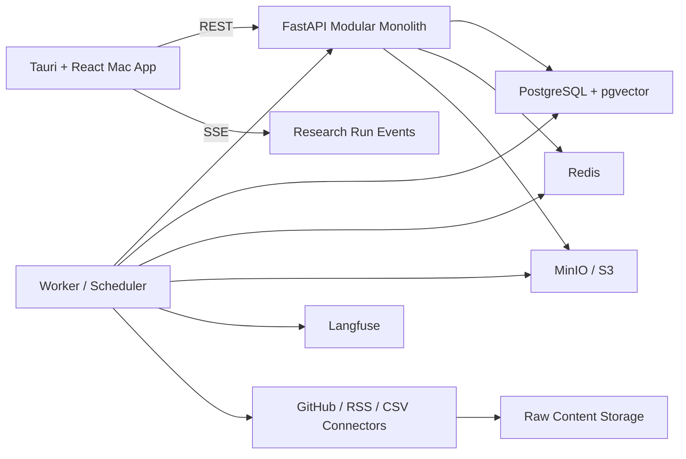

# Project Structure

Verification date: 2026-07-15

This is the target structure contract. Phase 0 does not create this scaffold. Future implementation should use this as a boundary map for a modular monolith plus worker and Mac client.

## Target Tree

```text
Glint/
  apps/
    mac/
      src/                         # React UI application
      src-tauri/                   # Tauri Rust shell, permissions, plugins, sidecars
      tests/                       # Playwright desktop/UI smoke tests
  services/
    api/
      app/
        main.py                    # FastAPI composition root
        core/                      # config, auth, logging, errors, telemetry
        modules/
          workspaces/
          projects/
          watchlists/
          sources/
          content/
          signals/
          investigations/
          research/
          evidence/
          claims/
          synthesis/
          decisions/
          evaluations/
          notifications/
          audit/
        db/                        # SQLAlchemy session, Alembic integration
        api/                       # REST routers and SSE endpoints
      tests/
    worker/
      app/
        main.py                    # worker entrypoint
        jobs/                      # collection, normalization, signal, research jobs
        schedules/                 # scheduler definitions
        pipelines/                 # idempotent processing pipelines
      tests/
  packages/
    contracts/
      openapi/                     # generated/reviewed API contracts
      events/                      # SSE event schemas
      schemas/                     # shared JSON Schema/Pydantic/TypeScript schemas
    domain/
      README.md                    # domain vocabulary and invariants
    ui/
      README.md                    # future design-system package boundary
    config/
      eslint/
      typescript/
      ruff/
      pyright/
  connectors/
    github/
    rss/
    csv/
    agent_reach/                   # future adapter only, gated by review
    tests/
      contract_fixtures/
  tests/
    contract/
    integration/
    e2e/
    eval/
    security/
    license/
    performance/
  infra/
    docker-compose.yml
    docker/
    migrations/
    observability/
    scripts/
  docs/
    REUSE_MATRIX.md
    RISK_REGISTER.md
    IMPLEMENTATION_PLAN.md
    PROJECT_STRUCTURE.md
    QUALITY_GATES.md
    SEED_DATASET_SPEC.md
```

## Boundary Rules

| Boundary | Rule |
|---|---|
| `apps/mac` -> API | UI calls REST/SSE contracts only. It must not depend on database schemas, worker internals, LangGraph node names, or connector-specific output. |
| `src-tauri` -> local OS | Tauri permissions are explicit and minimal. Shell sidecars are allowlisted and never receive raw user prompts as commands. |
| API modules -> database | Domain services own writes. Routers validate/authenticate and call services. Agent output is never persisted without schema validation. |
| Worker -> API/domain | Worker executes typed idempotent jobs and domain services. Only ImportFinalizationJob may resolve a fixed ImportSession/finalize command; downstream import jobs require terminal import_manifest_id. Every job records IDs, input/output counts, retries and trace IDs. |
| Connectors -> domain | Connectors output normalized `RawContentItem` / `ConnectorHealth` contracts. They do not create Signals, Investigations, ClaimVersions, syntheses, or Decision Briefs. |
| Research graph -> domain | LangGraph orchestrates one ResearchRun inside an Investigation but does not define product state machines. Model-visible tools are read-only; Domain Services own proposal persistence and all lifecycle transitions. |
| Contracts -> clients | API/event/schema changes require contract tests and generated client updates. |

## Core Domain Modules

| Module | Owns | Does not own |
|---|---|---|
| Workspaces | workspace, members, roles, permissions | external source credentials |
| Watchlists | business questions, entities, aliases, source selection, rules | collection execution |
| Sources | connections, capabilities, health, credential references, freshness; one-active ImportSession, append-only TransferConsentRecord/effective-consent resolver, dedicated finalization command and terminal ImportManifest lifecycle | signal scoring or downstream consumption of unfinished imports |
| Content | raw snapshots, normalized items, content versions, dedupe clusters | ClaimVersions or syntheses |
| Signals | anomaly candidates, trigger explanation, status, evidence samples | full research synthesis |
| Investigations | Decision Question, scope versions, aggregate status, run/claim/evidence summaries | execution checkpoint internals |
| Research | run plan, tasks, events, checkpoints, read-only tool executions | source connector implementation or direct domain writes |
| Evidence | immutable evidence anchors, append-only EvidenceReviews, quote spans and source version links | report prose or mutable review status |
| Claims | Claim aggregate, immutable ClaimVersions, append-only same-Investigation ClaimEvidence, ClaimReviews with frozen evidence-review snapshots and derived projection | rich text layout |
| Synthesis | Investigation-scoped immutable InvestigationSynthesisVersions, append-only SynthesisReviews and derived projection | independent navigation, owner or long-term decision state |
| Decisions | Product Decision Brief, singly grounded immutable DecisionBriefVersions, readiness/freshness records, typed blocks and terminal BriefExport records | independently editable PRD Input, synthesis bypass or unsupported auto-publishing |
| Evaluations | datasets, runs, metrics, human feedback | production truth labels without review |
| Audit | high-risk action log | routine debug logs |

## Event Contract

Research runs use SSE as the default real-time channel:

```text
GET /v1/research-runs/{id}/events
Content-Type: text/event-stream
```

Every event must include:

```json
{
  "event_id": "uuid",
  "run_id": "uuid",
  "sequence": 42,
  "timestamp": "2026-07-15T00:00:00Z",
  "event_type": "claim.version_proposed",
  "payload": {},
  "trace_id": "string"
}
```

The shared schema owns one explicit mapping: persistence `research_run_id/type/payload_json/occurred_at` serializes as public `run_id/event_type/payload/timestamp`; generated contract tests assert identical values. `ToolExecution.research_run_id` remains an internal persistence field and is never serialized as a raw database row.

Required event types:

```text
run.queued
run.started
run.waiting_for_input
run.resumed
task.started
task.completed
task.failed
tool.started
tool.completed
tool.failed
evidence.proposed
evidence.reviewed
claim.version_proposed
claim.version_reviewed
claim.version_superseded
synthesis.proposed
synthesis.reviewed
review.required
run.cancelled
run.completed
run.failed
stream.reset        # transport control; no business sequence
```

The client first fetches GET /v1/research-runs/{id}. SSE replays only committed RunEvents after the stored cursor. heartbeat and stream.reset are transport controls and never consume the RunEvent sequence.

## Source Connector Contract

Future connectors should conform to the following interface shape. This is a contract description, not implementation code:

```text
SourceConnector
  connector_type
  search(query) -> RawContentItem[]
  fetch(external_id) -> RawContentItem
  health() -> ConnectorHealth
  capabilities() -> ConnectorCapabilities
```

Contract tests must cover search, fetch, health, pagination, rate limit, timeout, invalid credential, partial failure, and source content version change.

## Local And Cloud Responsibilities

| Responsibility | Mac client | Cloud/API/worker |
|---|---|---|
| UI and keyboard workflow | Primary | None |
| Recent local cache | SQLite cache only | Source of truth remains Postgres |
| Credentials | macOS Keychain / Stronghold references | Server-side secrets for cloud sources |
| Local CSV/private file parsing | Yes; create metadata/digest-only session and explicit exact-scope consent | Issue scoped grant, verify uploaded object, finalize immutable manifest/content; workers accept terminal manifest only |
| Continuous cloud collection | Status display only | Scheduler + worker |
| Signal detection | Display and local dev fixture only | Server-owned calculation |
| Research runs | UI, SSE, human review | Phase 1 deterministic Seed/CSV run; Phase 3 LangGraph + domain services |
| Audit logs | Display | Write source of truth |

## Architecture Sketch


