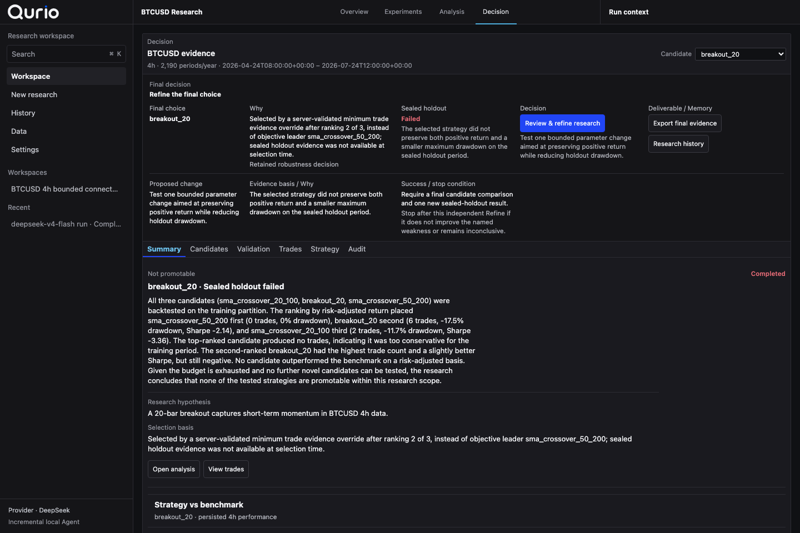

# Qurio case study — a useful failure

## The question

Can one bounded Research Agent investigate simple, interpretable BTCUSD strategies,
adapt once from training evidence, and reach an honest conclusion without opening the
sealed holdout early?

This case is a retained live engineering proof. It uses real Kraken market data and a
real DeepSeek decision provider. It is not a profitability or production-reliability
claim.

## The retained boundary

| Item | Value |
|---|---|
| Run | `6ad1c324-b6c5-55af-aa51-411d676b15d8` |
| Dataset | Kraken Spot `BTCUSD · 4h` |
| Bars | 548 closed bars; one current uncommitted bar dropped |
| Coverage | 2026-04-24 08:00 UTC → 2026-07-24 12:00 UTC |
| Provider | DeepSeek |
| Model | `deepseek-v4-flash` |
| Mock fallback | Disabled |
| Agent iterations | 11 |
| Experiment budget used | 3 |

The model could select only registered research actions. The deterministic evaluator,
not the model, calculated returns, drawdown, trades, walk-forward results, comparisons,
and the sealed-holdout result.

## What happened

### 1. Establish two base candidates

The approved plan produced:

- Candidate A: `sma_crossover_20_100`
- Candidate B: `breakout_20`

Both were evaluated on the training partition. The resulting comparison became the
only evidence available to the Agent for its one planned adaptation.

### 2. Reject an invalid adaptation

The Agent proposed Candidate C, `sma_crossover_50_200`, but its first create call used
an invalid relationship between the candidate family and the replan action. The server
rejected the call with `ITERATION_REPLAN_TEMPLATE_RELATION_INVALID`.

The next model turn received the rejected arguments and typed error. It changed only
`replan_decision.action` to `switch_approved_family`; the corrected call succeeded. The
run retained exactly one failed tool call, one correction delta, and no repeated failure.


### 3. Separate ranking from selection

Training metrics ranked the candidates C, B, A. Candidate C, however, produced zero
training trades. Qurio's deterministic minimum-trade evidence rule therefore selected
B through a `robustness_override` while retaining C's higher raw rank and the reason it
was not chosen.


This distinction matters: an autonomous system should not silently equate a favorable
metric with sufficient evidence.

### 4. Open the sealed holdout once

Only after the final candidate was frozen did Qurio evaluate Candidate B on the fresh
sealed holdout. B failed. The completed run retained:

```text
holdout_status: fail
next_step: revise_research
```



The process completed successfully even though the research conclusion was negative.
Qurio did not promote the candidate, rewrite the objective, or reopen the holdout for
another attempt.

## Why this is the primary portfolio case

A passing backtest can demonstrate workflow completion. This case demonstrates the
harder boundary:

- the Agent's action was invalid and visibly rejected;
- the correction was narrow and inspectable;
- raw ranking was not allowed to override insufficient trade evidence;
- the sealed holdout remained isolated;
- a failed holdout produced a useful next action instead of a success narrative.

## Evidence integrity

The committed evidence file is a byte-for-byte copy of the sanitized verifier output:

- [Sanitized live evidence](./evidence/qurio-v1-kraken-deepseek.json)
- File SHA-256:
  `9bc4c3c084b731f7db724db880fadd34f7d9ae7720a361b6193c27262ae3c106`
- Dataset digest:
  `sha256:e36cf65b83f08df44ce4bb756a0a008fbc5cbb06f4655013748d820f08dd7c32`
- Sealed split digest:
  `sha256:5f79ded9e391573230f29636962016caca5b93fab14c36c9d44ad4c72cac86a1`
- Runtime descriptor digest:
  `sha256:8a5df1705450479921181b72751ba4efe74681ff1dc03947358c501c51c16e62`

The evidence contains no Provider credential, local database path, or user secret.

## What this case does not prove

- It does not establish future alpha or statistical significance.
- It does not establish production scale, uptime, or user demand.
- It does not compare DeepSeek against a broad model or prompting benchmark.
- It does not authorize broker, order, arbitrary-code, or live-trading actions.

Those limitations are part of the result, not footnotes to hide.
